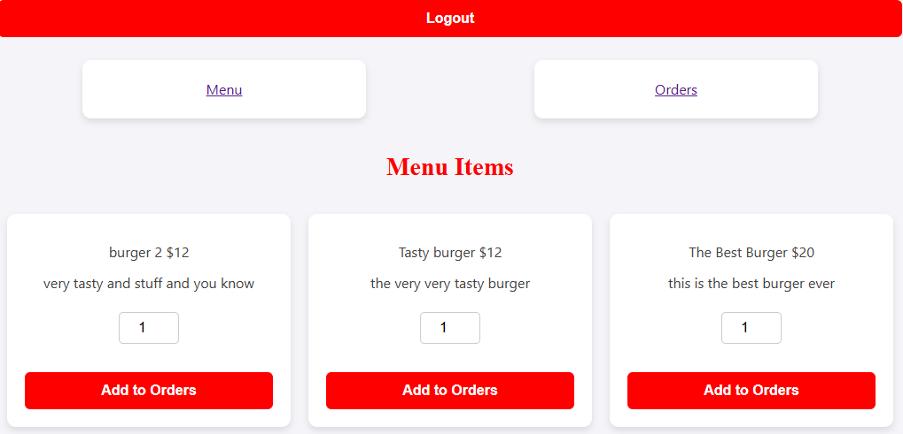

# Project 3: 'Bite Now' 

### Introduction

In this Project I lworked alongside my group member Muhannad to work on a restaurant application that simulates both owner and user experiences. Customers on our website can place orders by selecting things from the menu and the Owner can change order status, add items, edit or even delete from the menu.

### Technologies Used

- CSS3
- JavaScript
- MongoDB
- Express
- Node.js
- React
- GitHub

### Get Started

- Instructions: Any new user will have have to sign-up to the website before interacting with any sort of feature in the website, after singing up a user can be guided by the navigation bar at the top to perform their desired need from the application. The user can add new subscriptions that can be viewed in either the all subscriptions page or the selected categories. When interacting with the card a user can edit the original content of the subscription or completely delete a subscription.

### Development

The development of this project was a new experience for the both of us, we became familiar with the process and structuring of modern day full stack applications. Dealing with frameworks for the first time was an interesting experience, it allowed us to understand more through error handling and experimenting on different features. building components and making them interact with each other was a fun experience. 

### Attributions

- Stack Overflow in general

### Next Step

- Add more customer features
- Addressing map features
- More design features
- Anything can be improved

### Conclusion

We had a chance to reflect after finishing the project, we believe we did a good job for a small start but this is nowhere near the level of what we can achieve. If we weren't held back by error handling and conflicting schedules we could have added more life and vibrance to the website. There is much more to imporve and a lot to work on in the future.